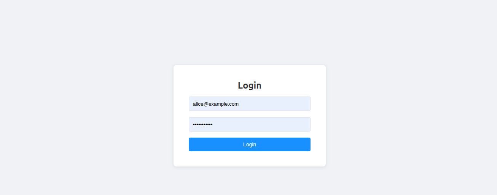
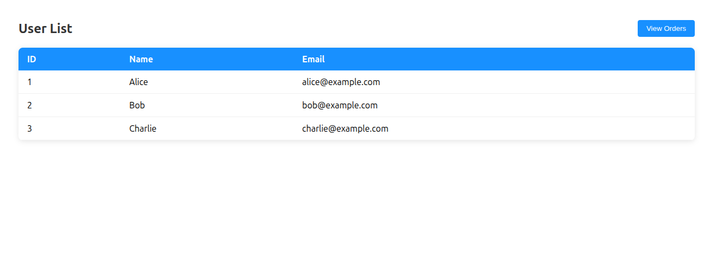
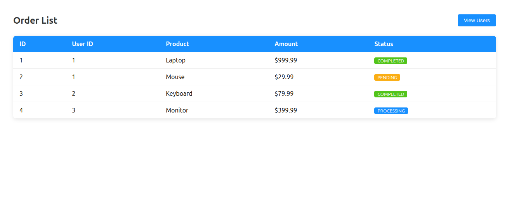

# Spring Microservice Demo

A full-stack microservice application built with Java 17, Spring Boot 3, Spring Cloud, and React.

## Architecture
Client (React)
|
v
API Gateway (port 8080)
|
+---> User Service (port 8081) --> H2 Database
|
+---> Order Service (port 8082) --> H2 Database
|
+---> calls User Service via Feign + Eureka
Service Registry: Eureka Server (port 8761)

## Tech Stack

### Backend
- **Java 17**
- **Spring Boot 3.2**
- **Spring Cloud 2023**
- **Spring Cloud Gateway** — API Gateway with load balancing
- **Eureka** — Service discovery and registration
- **Spring Data JPA** — Database access
- **H2** — In-memory database
- **OpenFeign** — Declarative service-to-service REST client
- **Resilience4j** — Circuit breaker pattern
- **Spring Security + JWT** — Authentication and authorization
- **Springdoc OpenAPI** — Swagger API documentation
- **Spring @RestControllerAdvice** — Centralized exception handling

### Frontend
- **React 18**
- **React Router** — Client-side routing
- **Axios** — HTTP client

### DevOps
- **Docker + Docker Compose** — Containerization

## Services

| Service | Port | Description |
|---------|------|-------------|
| Eureka Server | 8761 | Service registry |
| API Gateway | 8080 | Single entry point |
| User Service | 8081 | User management + JWT auth |
| Order Service | 8082 | Order management |
| Frontend | 3000 | React web application |

## Getting Started

### Option 1: Run with Docker

```bash
# Build backend services first
cd backend
mvn package -DskipTests

# Start all services
cd ..
docker-compose up --build
```

### Option 2: Run locally

**Step 1: Start Eureka Server**
```bash
cd backend/eureka-server
mvn spring-boot:run
```

**Step 2: Start User Service**
```bash
cd backend/user-service
mvn spring-boot:run
```

**Step 3: Start Order Service**
```bash
cd backend/order-service
mvn spring-boot:run
```

**Step 4: Start API Gateway**
```bash
cd backend/api-gateway
mvn spring-boot:run
```

**Step 5: Start Frontend**
```bash
cd frontend
npm install
npm start
```

## API Endpoints

All requests go through the API Gateway on port 8080.

### Authentication

POST /api/users/login
Body: { "email": "alice@example.com", "password": "password123" }
Returns: { "token": "eyJ..." }


### Users (requires JWT token)
GET  /api/users          # Get all users
GET  /api/users/{id}     # Get user by ID
POST /api/users/register # Register new user
DELETE /api/users/{id}   # Delete user

### Orders (requires JWT token)
GET  /api/orders              # Get all orders
GET  /api/orders/{id}         # Get order by ID
GET  /api/orders/user/{id}    # Get orders with user info (cross-service call)
POST /api/orders              # Create order
DELETE /api/orders/{id}       # Delete order

## Key Features

- **Service Discovery** — Services register with Eureka and find each other by name, no hardcoded URLs
- **Load Balancing** — API Gateway uses client-side load balancing via `lb://` prefix
- **Circuit Breaker** — If User Service is unavailable, Order Service returns fallback response instead of failing
- **JWT Authentication** — Stateless authentication, all protected endpoints require Bearer token
- **API Documentation** — Swagger UI available at `http://localhost:8080/swagger-ui.html`
- **Global Exception Handler** — Unified error response format across all services, returns consistent JSON with status, message, and timestamp

## Demo Accounts

| Email | Password |
|-------|----------|
| alice@example.com | password123 |
| bob@example.com | password123 |
| charlie@example.com | password123 |

## Screenshots

### Login


### User List


### Order List


## Related Projects

- [kotlin-android-client](https://github.com/hllld/kotlin-android-client) — Android client for this API (coming soon)
